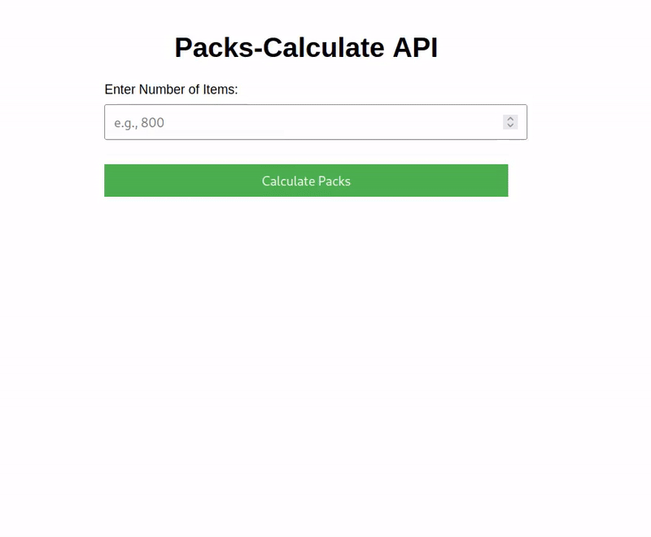
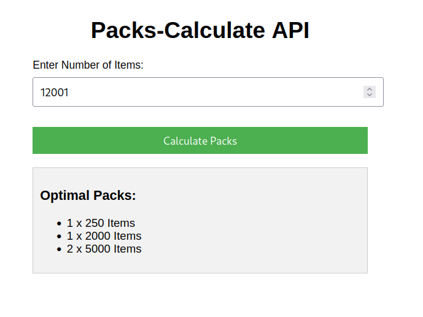

# Packs-Calculate





A Go application to calculate the optimal number of packs required to fulfill an order. The app minimizes the number of packs used while ensuring that the required number of items is fulfilled using the smallest number of packs.

## Features

- Uses approach to select the largest packs first.
- Post-processes the result to minimize pack usage by consolidating smaller packs into larger ones when possible.
- Configurable API port, host, and pack sizes through environment variables or a `.env` file.
- Exposes an HTTP API to calculate the number of packs needed for a given order.

## Getting Started

### Prerequisites

- [Go](https://golang.org/dl/) version 1.18 or higher
- [Docker](https://www.docker.com/products/docker-desktop) (optional for containerization)

### Installation

Clone the repository:

```bash
git clone https://github.com/daniilsolovey/packs-calculate.git
cd packs-calculate
```

If you don't have Go modules set up, run:

```bash
go mod tidy
```

You can build the Go application using:

```bash
make build
```

After building, you can run the application with:

```bash
./packs-calculate
```

By default, the application will calculate the packs for a predefined order.

### Running with Docker

If you want to run the application inside a container, build the Docker image with the following command:

```bash
make docker-build
```

After the image is built, run the application inside a Docker container:

```bash
make docker-run
```

### Running with Environment Variables

The application supports two ways of setting configuration values:

1. **From a `.env` file** (preferred for easy configuration management).
2. **From environment variables directly**.

You can pass an `.env` file location via a flag or set the environment variables manually.

#### Using `.env` File

Create a `.env` file in the root of your project (same level as `go.mod`) with the following contents:

```
API_HOST=localhost
API_PORT=8080
PACK_SIZES=5000,2000,1000,500,250
```

Run the application by specifying the `.env` file with the `-env` flag:

```bash
./packs-calculate -env=.env
```

If the `.env` file exists, the application will load the configuration from it.

#### Using Environment Variables

If you prefer to set the environment variables directly, you can do so like this:

```bash
export API_HOST="localhost"
export API_PORT="8080"
export PACK_SIZES="5000,2000,1000,500,250"

./packs-calculate
```

If the `.env` file is not provided, the application will fall back to using the environment variables.

### Running Tests

To run the tests for this application:

```bash
make test
```

This will run all the unit tests defined in `internal/pack/pack_test.go`.

### Example Usage

The application exposes an HTTP API to calculate the number of packs required to fulfill a given order. You can send a **POST** request to the `/calculate` endpoint with the `number` of items in the body of the request, and the API will return the optimal number of packs.

#### Example Request

Send a `POST` request to `http://localhost:8080/calculate` with a JSON body like this:

```json
{
  "number": 800
}
```

### Expected Output

For an order of 800 items with the pack sizes `[5000, 2000, 1000, 500, 250]`, the expected output will be:


```bash
Result: map[1000:1]
```

```bash
curl -X POST http://localhost:8080/calculate -d '{"number": 800}' -H "Content-Type: application/json"

```

### Example Usage with simple UI

Go to http://localhost:8080/ in browser

Enter numbers of items, then tap "Calculate Packs"




### Folder Structure

```
packs-calculate/
├── cmd/                # Main application entry point
│   └── calculate/      # Main Go entry file (main.go)
├── internal/           # Business logic
│   ├── pack/           # Packing algorithm logic
│   └── utils/          # Utility functions (optional)
├── pkg/                # Public shared libraries (optional)
├── ui/                 # UI
│   ├── index.html/     # index.html
├── api/                # API folder for HTTP server and routes
│   └── api.go          # API routes and server
├── config/             # Configuration management
│   └── config.go       # Load config variables (port, host, packs)
├── go.mod              # Go module file
├── Dockerfile          # Docker configuration for the app
├── README.md           # Project documentation
└── go.sum              # Go dependencies lock file
```
